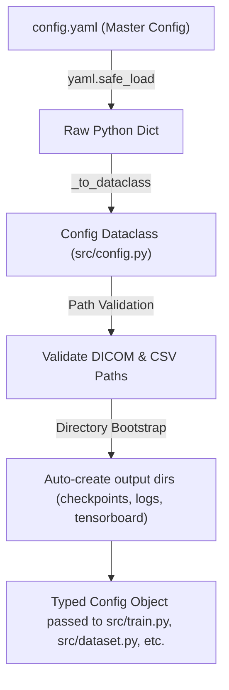

# Configuration Base Learning Notes: Pneumonia Segmentation U-Net

> **Target Goal**: Validation Dice Coefficient $\ge 0.70$  
> **Dataset**: RSNA Pneumonia Detection Challenge (Chest X-Rays in DICOM format)  
> **Core Architecture**: Attention U-Net with `timm-efficientnet-b3` backbone & scSE decoder attention  
> **Master Config File**: [`config.yaml`](file:///home/louiscalvin/Projects/github/pneumonia-segmentation-unet/config.yaml)  
> **Python Typed Loader**: [`src/config.py`](file:///home/louiscalvin/Projects/github/pneumonia-segmentation-unet/src/config.py)  

---

## 1. System Architecture & Load Pipeline

The project follows a **single-source-of-truth configuration architecture**. All data paths, model choices, training schedules, loss formulations, data augmentations, inference rules, and web app settings are centralized in `config.yaml`.



### Typed Schema Mapping (`src/config.py`)

Instead of passing unvalidated dictionaries across modules, `src/config.py` converts raw YAML data into strong dataclasses:

- **`Config`**: Parent container holding all configuration sub-dataclasses:
  - `DataConfig`: Dataset paths & negative sample ratio.
  - `PreprocessingConfig`: Resolution, DICOM windowing, CLAHE, and normalization.
  - `ModelConfig`: Architecture, encoder, decoder channels, attention (`scse`), dropout, auxiliary head.
  - `TrainingConfig`: Batch size, epochs, AMP, gradient accumulation, EMA, encoder freezing.
  - `OptimizerConfig`: Optimizer type, learning rates, weight decay, differential encoder factor.
  - `SchedulerConfig`: Learning rate schedule parameters (Cosine Annealing).
  - `LossConfig`: Loss parameters (Unified Focal Loss, Focal Tversky weights).
  - `AugmentationConfig`: Albumentation probabilities & parameters.
  - `InferenceConfig`: Post-processing threshold, Test-Time Augmentation (TTA), overlay aesthetics.
  - `EvaluationConfig`: Evaluation metrics & output locations.
  - `ExplainabilityConfig`: Grad-CAM visualization target layer & colormap.
  - `AppConfig`: Gradio UI server configuration.
  - `OutputConfig`: Target logging & checkpoint directory paths.

---

## 2. Key Strategy & Hyperparameter Design (v1 $\rightarrow$ v2 Evolution)

The configuration v2 reflects a targeted strategy to achieve **Dice $\ge 0.70$** by solving two main bottlenecks identified in v1: **Catastrophic Forgetting of Pretrained Encoder Weights** and **High False Positive Rates (Low Precision)**.

| Parameter / Configuration Key | v1 Value | v2 Value | Core Strategic Rationale |
|---|---|---|---|
| `optimizer.encoder_lr_factor` | `0.1` | `0.02` | **Critical Fix**: Encoder LR is 50x slower than decoder ($4.0 \times 10^{-4} \times 0.02 = 8.0 \times 10^{-6}$). Prevents unfreezing from destroying pretrained ImageNet representations. |
| `training.encoder_freeze_epochs` | `8` | `12` | Extended decoder-only warm-up period. Decoder stabilizes its weights before fine-tuning encoder features. |
| `loss.type` | `dice_bce_iou` | `unified_focal` | Combines Focal Loss + Focal Tversky Loss to focus on hard boundary pixels and heavily punish false positives. |
| `loss.tversky_alpha` / `tversky_beta` | `0.4` / `0.6` | `0.3` / `0.7` | Sets $\beta = 0.7$ (FP penalty) vs $\alpha = 0.3$ (FN penalty). Penalizes False Positives **2.33x heavier** than False Negatives to boost precision from 0.57. |
| `scheduler.type` | `one_cycle` | `cosine_annealing` | `OneCycleLR`'s aggressive warmup spike destabilized encoder weights. Cosine annealing provides smooth, monotonic decay. |
| `optimizer.weight_decay` | `1e-4` | `5e-4` | Stronger L2 regularization to combat overfitting (v1 train Dice 0.62 vs val Dice 0.51). |
| `data.negative_ratio` | `0.30` | `0.10` | 10% negative images in training set focuses gradient updates on positive infection boundaries while maintaining validation baseline. |
| `training.accumulation_steps` | `8` | `4` | Batch size 8 $\times$ 4 accum steps = **Effective batch size of 32**. Provides more frequent optimizer updates per epoch while keeping GPU memory stable. |
| `optimizer.lr` | `3e-4` | `4e-4` | Scaled for effective batch size 32 (up from batch size 16 in earlier trials). |
| `model.decoder_dropout` | `0.3` | `0.2` | Reduced dropout to maintain decoder capacity for fine-grained lesion boundary learning. |
| `training.use_ema` / `ema_decay` | `0.999` | `0.9995` | Smoother Exponential Moving Average of weights for robust validation performance. |
| `inference.threshold` | `0.50` | `0.65` | Higher decision threshold during inference filters low-confidence false positive pixel predictions. |

---

## 3. Comprehensive Breakdown of Configuration Sections

### 3.1 Dataset Configuration (`data`)
```yaml
data:
  rsna_root: "data/rsna-pneumonia-detection-challenge"
  train_dicom_dir: "data/rsna-pneumonia-detection-challenge/stage_2_train_images"
  train_labels_csv: "data/rsna-pneumonia-detection-challenge/stage_2_train_labels.csv"
  mask_dir: "data/lung_masks/combined"
  lung_mask_dir: "data/lung_masks/lung_segmentation"
  negative_ratio: 0.10
```
- **Mask Hierarchy**: Precomputed PNG masks in `mask_dir` override bounding-box derived masks from `train_labels_csv`.
- **Anatomical Masking**: `lung_mask_dir` is used to zero-out non-lung anatomical regions, ensuring predictions remain inside lung fields.

### 3.2 Preprocessing (`preprocessing`)
```yaml
preprocessing:
  image_size: [512, 512]
  window_level: -600
  window_width: 1500
  use_clahe: true
  clahe_clip_limit: 2.0
  clahe_grid_size: [8, 8]
  normalize: true
  mean: [0.485, 0.456, 0.406]
  std: [0.229, 0.224, 0.225]
```
- Images are resized to **512x512**.
- Contrast-Limited Adaptive Histogram Equalization (**CLAHE**) enhances subtle lung opacities before feeding into the network.

### 3.3 Model Architecture (`model`)
```yaml
model:
  architecture: "Unet"
  encoder_name: "timm-efficientnet-b3"
  encoder_weights: "imagenet"
  in_channels: 3
  classes: 1
  decoder_attention_type: "scse"
  decoder_channels: [256, 128, 64, 32, 16]
  decoder_dropout: 0.2
  auxiliary_head: true
  auxiliary_head_weight: 0.3
```
- **Backbone**: `timm-efficientnet-b3` provides high feature extraction capability while keeping compute overhead reasonable.
- **Attention**: Concurrent Spatial and Channel Squeeze & Excitation (**scSE**) blocks inside the decoder accentuate features spatially and channel-wise.
- **Auxiliary Loss**: Auxiliary classification head ($weight = 0.3$) provides deep supervision during intermediate decoder feature maps.

### 3.4 Loss Function (`loss`)
```yaml
loss:
  type: "unified_focal"
  bce_weight: 0.5
  tversky_alpha: 0.3
  tversky_beta: 0.7
  tversky_gamma: 0.75
  focal_alpha: 0.25
  focal_gamma: 2.0
```
- **Unified Focal Loss**: Formulated as $(1 - w) \cdot \text{FocalTversky} + w \cdot \text{FocalLoss}$.
- **Focal Loss**: Ignores easy-to-classify background pixels and forces gradient attention onto ambiguous boundaries.
- **Focal Tversky Loss**: Asymmetric weights ($\beta = 0.7 > \alpha = 0.3$) punish false positive region proposals.

### 3.5 Augmentation (`augmentation`)
```yaml
augmentation:
  enabled: true
  horizontal_flip_prob: 0.5
  rotation_limit: 10
  shift_limit: 0.1
  scale_limit: 0.15
  brightness_contrast_prob: 0.4
  coarse_dropout_prob: 0.10
  grid_distortion_prob: 0.15
```
- **Anatomical Realism**: Rotation is restricted to $\le 10^\circ$ to maintain valid chest geometry. Elastic transforms are disabled to prevent distorting rib cage structures.

### 3.6 Inference & Test-Time Augmentation (`inference`)
```yaml
inference:
  model_path: "outputs/checkpoints/best_model.pth"
  threshold: 0.65
  use_tta: true
  tta_transforms: ["null", "hflip", "vflip"]
  tta_merge_mode: "mean"
```
- **TTA**: Combines raw, horizontally flipped, and vertically flipped predictions via mean aggregation to improve boundary reliability and reduce variance.

---

## 4. Usage in Codebase

1. **Training (`src/train.py`)**:
   Reads `config.training`, `config.optimizer`, `config.scheduler`, `config.loss`, and `config.model` to initialize training state, AMP scalers, loss functions, and EMA parameters.
2. **Dataset Processing (`src/dataset.py`)**:
   Consumes `config.data` and `config.preprocessing` for loading DICOMs, applying lung masks, and structuring stratified cross-validation splits.
3. **Augmentations (`src/transforms.py`)**:
   Translates `config.augmentation` into Albumentations pipeline composition.
4. **Gradio Application (`app/gradio_app.py`)**:
   Consumes `config.app` (host, port, title) and `config.inference` (threshold, TTA) to deliver real-time interactive predictions.

---
*Learning document compiled automatically based on `config.yaml` and `src/config.py`.*
